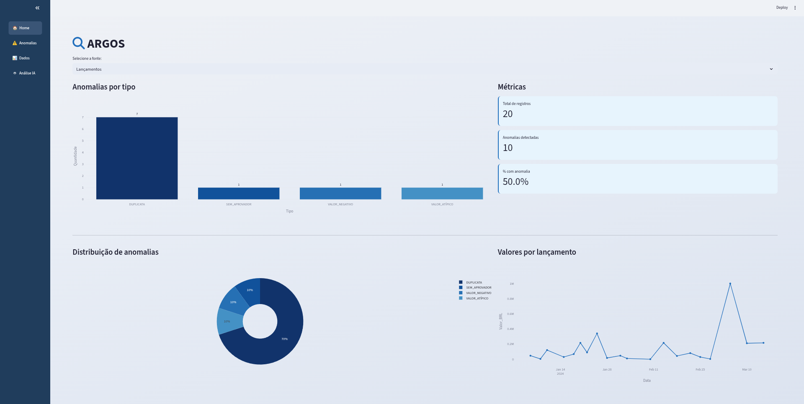
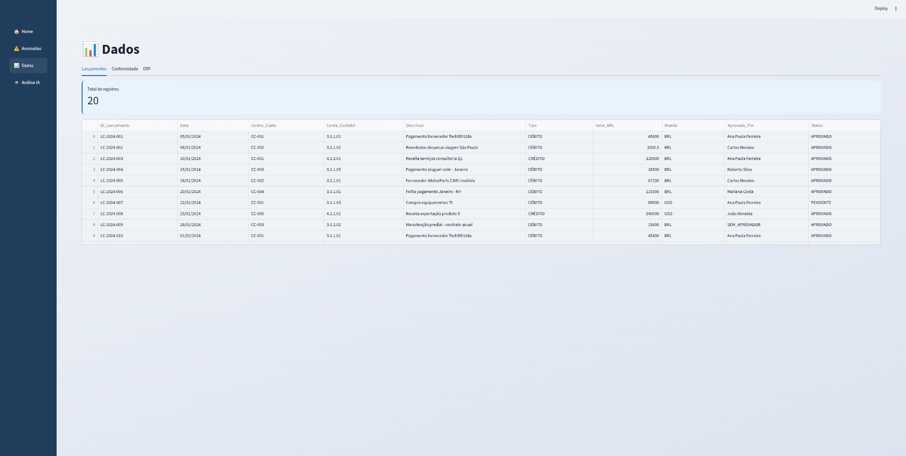
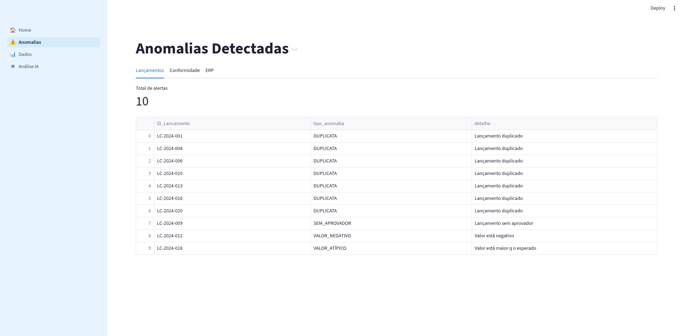
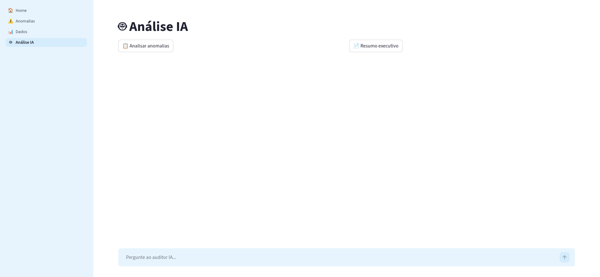

# 🔍 Pipeline de Auditoria Interna com IA

Pipeline de dados para auditoria interna corporativa — automatiza a ingestão, limpeza, detecção de anomalias e geração de relatórios a partir de planilhas Excel e exportações de ERP, com dashboard interativo e análise por IA (Groq).

---

## 📋 Sobre o Projeto

Projeto desenvolvido para simular o fluxo de trabalho de um auditor interno em uma multinacional. O pipeline processa três fontes de dados distintas, detecta inconsistências automaticamente e gera um relatório consolidado — reduzindo horas de trabalho manual para minutos.

**Fontes de dados suportadas:**
- Lançamentos contábeis (`.xlsx`)
- Relatório de conformidade (`.xlsx`)
- Exportação de sistema ERP (`.csv`)

---

## 🚀 Funcionalidades

- **Ingestão automática** de múltiplos formatos com tratamento de encoding e tipos de dados
- **Limpeza e padronização** — normalização de strings, tratamento de nulos, correção de decimais
- **Detecção de anomalias** — duplicatas, valores negativos, valores atípicos, CNPJ inválido, controles vencidos, lançamentos sem aprovador
- **Relatório Excel** com 4 abas: Lançamentos, Conformidade, ERP e Consolidado
- **Dashboard interativo** com Streamlit — visualização dos dados e anomalias com gráficos
- **Análise por IA** via API da Groq — comentários sobre anomalias e resumo executivo em linguagem simples

---

## 🗂️ Estrutura do Projeto

```
pipeline_dados/
│
├── Arquivos/                        # Dados de entrada
│   ├── lancamentos_contabeis.xlsx
│   ├── relatorio_conformidade.xlsx
│   └── exportacao_erp.csv
│
├── modules/                         # Módulos do pipeline
│   ├── __init__.py
│   ├── ingestao.py                  # Leitura dos arquivos
│   ├── limpeza.py                   # Padronização dos dados
│   ├── anomalias.py                 # Detecção de inconsistências
│   ├── relatorio.py                 # Geração do Excel de saída
│   └── ia.py                        # Integração com API Groq
│
├── outputs/                         # Relatórios gerados
│   └── relatorio_auditoria.xlsx
│
├── logs/                            # Logs de execução
│
├── app.py                           # Dashboard Streamlit
├── main.py                          # Orquestrador do pipeline
├── .env                             # Chave da API Groq (não versionar)
├── .gitignore
├── requirements.txt
└── README.md
```

---

## 📸 Screenshots

### Home / Visão Geral


### Dados e Resultados


### Detecção de Anomalias


### Análise Executiva com IA


---

## ⚙️ Instalação

**1. Clone o repositório:**
```bash
git clone https://github.com/Aiel-rgb/pipeline-auditoria.git
cd pipeline-auditoria
```

**2. Crie e ative o ambiente virtual:**
```bash
python -m venv venv
source venv/bin/activate  # Linux/macOS
venv\Scripts\activate     # Windows
```

**3. Instale as dependências:**
```bash
pip install -r requirements.txt
```

**4. Configure a chave da API Groq:**

Crie um arquivo `.env` na raiz do projeto:
```
GROQ_API_KEY=sua_chave_aqui
```

> Obtenha sua chave gratuita em [console.groq.com](https://console.groq.com)

---

## ▶️ Como Usar

**Rodar o pipeline completo (gera o relatório Excel):**
```bash
python main.py
```

**Abrir o dashboard interativo:**
```bash
streamlit run app.py
```

---

## 🔎 Anomalias Detectadas


O pipeline identifica automaticamente as seguintes inconsistências:

| Fonte | Anomalia | Critério |
|---|---|---|
| Lançamentos | Duplicata | Mesmo centro de custo, conta, valor e aprovador |
| Lançamentos | Sem aprovador | Campo `Aprovado_Por` nulo |
| Lançamentos | Valor negativo | `Valor_BRL < 0` |
| Lançamentos | Valor atípico | `Valor_BRL > R$ 500.000` |
| Conformidade | Não conforme | `Status_Controle == "NÃO CONFORME"` |
| Conformidade | Sem execução | `Ultima_Execucao` nulo |
| ERP | CNPJ inválido | CNPJ `00.000.000/0001-00` |
| ERP | Valor negativo | `VALOR_TOTAL < 0` |
| ERP | Valor atípico | `VALOR_TOTAL > R$ 500.000` |
| ERP | Duplicata | Mesmo CNPJ emitente e valor total |

---

## 📦 Dependências

```
pandas
openpyxl
xlrd
streamlit
groq
python-dotenv
```

Instale tudo com:
```bash
pip install -r requirements.txt
```

---

## 🧱 Fluxo do Pipeline

```
Arquivos brutos
      ↓
  ingestao.py     → lê e tipifica os dados
      ↓
  limpeza.py      → padroniza strings, trata nulos, corrige decimais
      ↓
  anomalias.py    → detecta inconsistências e gera alertas
      ↓
  relatorio.py    → exporta Excel com 4 abas
      ↓
  ia.py           → Groq analisa os alertas e gera resumo executivo
      ↓
  app.py          → dashboard Streamlit com tudo integrado
```

---

## 👨‍💻 Autor

**Gabriel** — Estudante de Ciência da Computação (Estácio, Fortaleza-CE)  
Transição para Ciência de Dados | Portfólio: [portifolio-dados.vercel.app](https://portifolio-dados.vercel.app)  
GitHub: [@Aiel-rgb](https://github.com/Aiel-rgb)

---

## 📄 Licença

Este projeto está sob a licença MIT.